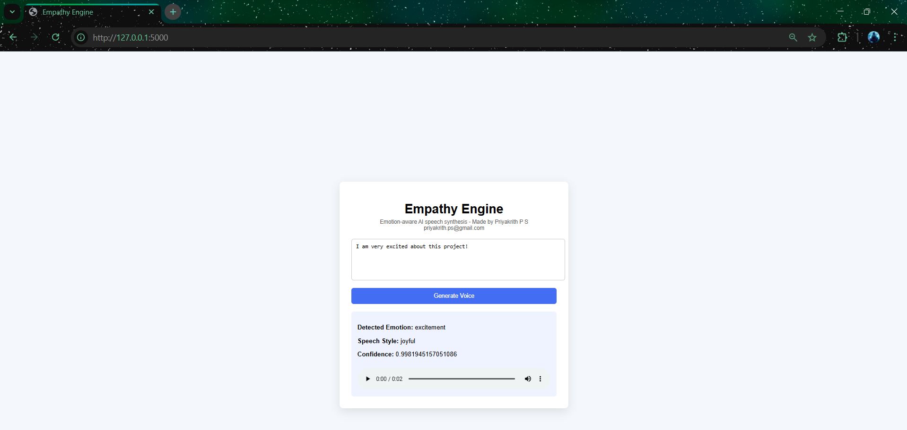

# Empathy Engine

Empathy Engine is an AI-powered system that detects emotions in text and
generates emotionally expressive speech using neural text-to-speech
synthesis.

The system analyzes user input using a transformer-based emotion
classifier and dynamically modulates speech parameters such as pitch,
rate, and emphasis to produce expressive audio output.

---

# Features

- Emotion detection using the GoEmotions transformer model (27
  emotions)
- Emotion grouping and style mapping
- Dynamic pitch and speech rate modulation
- SSML emphasis and pauses for emotional realism
- Neural speech synthesis using Google Cloud Text-to-Speech
- Interactive web interface built with Flask

---

# System Architecture

User Text Input\
↓\
Emotion Detection (GoEmotions Transformer)\
↓\
Emotion Mapping (27 emotions → speech styles)\
↓\
Voice Controller (pitch scaling, rate scaling, SSML emphasis)\
↓\
Google Neural Text-to-Speech\
↓\
Generated Audio Output

---

# Tech Stack

- Python
- Flask
- HuggingFace Transformers
- PyTorch
- Google Cloud Text-to-Speech
- HTML / CSS

---

# Project Structure

empathy-engine/ │ ├── app.py ├── requirements.txt ├── README.md │ ├──
modules/ │ ├── emotion_detector.py │ ├── emotion_mapper.py │ ├──
tts_engine.py │ └── voice_controller.py │ ├── templates/ │ └──
index.html │ └── static/ └── audio/

---

# Installation & Setup

## 1. Clone the repository

git clone https://github.com/Priyakrith_PS/empathy-engine.git\
cd empathy-engine

---

## 2. Create a virtual environment (recommended)

python -m venv venv

Activate it:

Windows\
venv`\Scripts`{=tex}`\activate`{=tex}

Mac/Linux\
source venv/bin/activate

---

## 3. Install dependencies

pip install -r requirements.txt

---

## 4. Setup Google Cloud Text-to-Speech

1.  Create a Google Cloud project\
2.  Enable **Cloud Text-to-Speech API**\
3.  Create a **Service Account**\
4.  Download the JSON credentials file

Place the JSON file in the project root.

Example:

ivory-setup-xxxx.json

The application loads this file to authenticate with the TTS service.

---

## 5. Run the application

python app.py

---

## 6. Open the web interface

http://127.0.0.1:5000

Enter text and click **Generate Voice** to produce emotionally
expressive speech.

---

# Emotion-to-Speech Design Choices

The GoEmotions model outputs 27 emotion classes.\
To simplify speech synthesis control, these emotions are grouped into a
smaller set of **speech styles**.

Example mapping:

Emotion → Speech Style

joy, excitement → joyful\
gratitude, love → warm_positive\
curiosity → curious\
sadness, disappointment → sad\
anger, annoyance → angry\
fear → fearful\
surprise → surprised\
neutral → neutral

---
## Demo

# Voice Parameter Modulation

Each speech style controls:

- Pitch (emotional tone)
- Speech rate (energy level)
- SSML emphasis / pauses

Example parameter settings:

Style Pitch Rate Behavior

---

joyful higher pitch slightly faster moderate emphasis
sad lower pitch slower pause before speech
angry strong pitch faster strong emphasis
surprised very high pitch faster quick pause

---

# Confidence-Based Intensity Scaling

The emotion classifier provides a confidence score.

This score is used to scale pitch and speech rate dynamically:

scale = 0.8 + confidence \* 0.4

This allows stronger emotional modulation when the model is more
confident.

Example:

Confidence Voice Effect

---

0.4 subtle modulation
0.7 moderate modulation
0.9 strong emotional speech

---

# Example Inputs

Joy\
I am extremely excited about this opportunity!

Sadness\
I feel very disappointed today.

Anger\
This situation is extremely frustrating!

Surprise\
Wait... what just happened?!

---

# Demo

---

# Future Improvements

- Real-time speech streaming
- Emotion detection from voice input
- More expressive neural voice models
- Multilingual emotional speech synthesis

---

# Author

Priyakrith P S\
Email: priyakrith.ps@gmail.com
